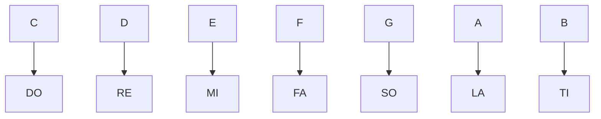

# Basic Musical Theory
## Scales, Chords, and Harmonic Fields
Scales, chords, and harmonic fields are fundamental concepts in music
theory that help musicians understand the building blocks of music.

*Scales are used to create chords, and chords are used to create harmonic fields.*

## Scales
A scale is a set of musical notes ordered by pitch or frequency. Notes are named using the first seven letters of the alphabet: A, B, C, D, E, F, and G. After G, the naming pattern repeats, starting again with A.

There are many different types of scales used in music, but some of the most common are:

- **Major Scale**: This is a diatonic scale consisting of seven notes, with a specific pattern of whole and half steps between each note. The major scale is used extensively in Western music, and many melodies and chords are based on it. You can see a [example](https://www.youtube.com/watch?v=vTJhpjIA0Fc).

- **Minor Scale**: This is another diatonic scale consisting of seven notes, but with a different pattern of whole and half steps. The minor scale has a darker and more melancholy sound than the major scale.  You can see a [example](https://www.youtube.com/watch?v=489e7lizfp4).

Scales can be transposed, meaning they can be moved up or down in pitch while maintaining the same pattern of whole and half steps. This is useful for changing the key of a song or piece of music.

## Chords
A chord is a group of `three or more notes played together`. Chords provide the harmonic framework for music and are often used to accompany a melody. *Chords are built from scales and follow specific patterns of intervals*.

- Triads: These are chords consisting of three notes played together. Triads are built by stacking thirds on top of each other. For example, a C major triad consists of the notes C, E, and G.

- Seventh Chords: These are chords consisting of four notes played together. Seventh chords are built by stacking thirds on top of each other, with an added fourth note that is a third above the top note of the triad. For example, a C7 chord consists of the notes C, E, G, and Bb.

Chords can be arranged in specific progressions to create a sense of tension and release in music. For example, the I-IV-V progression is a common chord progression in Western music that creates a sense of stability and resolution as the [example](https://www.youtube.com/watch?v=K4D0HGfusIg) shows.

## Harmonic Fields
A harmonic field is a `group of chords` that are related to each other through their use of shared notes. Harmonic fields are useful for creating chord progressions that sound coherent and logical. Some common harmonic fields include:

- Tonic: This is the main harmonic field of a piece of music, and is centered around the tonic or home key of the piece. Chords in the tonic field are built from the notes of the tonic scale, and provide a sense of stability and resolution.

- Dominant: This harmonic field is built around the fifth note of the tonic scale, and is used to create tension and prepare for resolution back to the tonic. Chords in the dominant field often contain the seventh note of the scale, which creates a strong urge to resolve to the tonic.

- Subdominant: This harmonic field is built around the fourth note of the tonic scale, and is used to create a sense of departure from the tonic. Chords in the subdominant field often lead back to the tonic or to the dominant.
