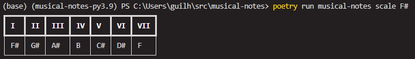
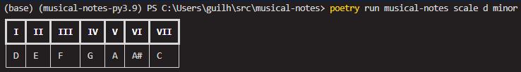
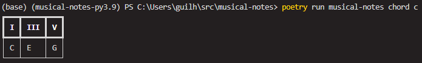

# Tutorial

If you've made it this far, it means you want to learn more about  `musical-notes` .

The objective of this project is to help music students or professionals
to easily access scales, chord formation, and harmonic fields.
Each of these commands is distributed in a subcommand of our cli.




## The commands

`musical-notes` distributes each function into a subcommand and you can
run each of them to test now. The objective of this tutorial is to explain
 the basic functioning of the command-line application.

The subcommands are divided into three functions so far: `scales`, `chords`,
 and `harmonic-fields`.

Let's understand what each one proposes to do now.

### Scales

The `scale` subcommand helps us to have easy access to the formation of
musical scales.

If invoked without any parameters, it will return the C major scale:

```bash
{{ commands.run }} scale
```

This will provide a table in the terminal informing the scale:

| I | II | III | IV | V | VI | VII |
| - | -- | --- | -- | - | -- | --- |
| C | D  | E   | F  | G | A  | B   |


One example of this in the terminal:


#### Variations in scales

To change the scales, you can change the parameters: `tonic` and
`tonality`. They are called in the following order:

```bash
{{ commands.run }} scale [TONIC] [TONALITY]
```

##### Tonic variation

The tonic variation can be done on any note. For example, if we want to
change the scale of F sharp (F#):

```bash
{{ commands.run }} scale F#
```

This will give us the following result:

| I  | II | III | IV | V | VI  | VII |
| -  | -- | --- | -- | - | --  | --- |
| F# | G# | A#  | B  | C# | D# | F   |

In terminal:




##### Tonality variation

You can change the tonality using the second parameter. For example,
the minor scale of D:

```bash
{{ commands.run }} scale d minor
```

Getting the following table:

| I | II | III | IV | V | VI | VII |
| - | -- | --- | -- | - | -- | --- |
| D | E  | F   | G  | A | A# | C   |


An example of the visualization in the terminal:




### Chords

The chords subcommand is based on showing which degrees are related within
the major scale. In a way that you pass a chord and it tells you which
notes are contained in that chord and the corresponding degrees.

For example, a D minor augmented chord `Dm+`:

```bash
{{ commands.run }} chord Dm+
```
this will show us the degrees and notes corresponding to this chord in
relation to the major scale of D:

| I | III- | V+ |
| - | ---- | -- |
| D | F    | A# |

Points to note regarding this response:


- The `-` symbolizes one semitone less. That is, to be the major chord,
`F` would have to be an `F#`.
- The `+` symbolizes one semitone more. That is, to be the major chord,
 `A#` would have to be an `A`.

!!! warning "About the chords"
	It is possible that the chords you are looking for have not yet been
	implemented. At the time I am writing this tutorial, only triad chords
	have been implemented. Therefore, you can use major, minor, augmented
	and diminished chords.
#### Another example for fixation

If we want to see a C major chord, we could pass its symbol and see the result:

```bash
{{ commands.run }} chord c
```

Obtaining the following result:

| I | III | V |
| - | --- | - |
| C | E   | G |


Note that in this case, we do not have any variation between degrees
because the chord is already major!

An example of the visualization of the table in the terminal:




### Harmonic fields


Harmonic fields are the representations of the scale using chords. And
its subcommand has the same usage as `scale`. However, its call varies to `harmonic-field`:

```bash
{{ commands.run }} harmonic-field [TONIC] [TONALITY]
```

#### Basic usage

If the command is called without any tonic, it will return the C major
harmonic field:

```bash
{{ commands.run }} harmonic-field
```

Obtaining, therefore, a table with all the corresponding chords of this field:

| I | ii | iii | VI | V | vi | vii° |
| - | -- | --- | -- | - | -- | ---- |
| C | Dm | Em  | F  | G | Am | B°   |


#### Variation of tonic

You can send the `tonic` of the harmonic field as the first parameter.
Such as the A major harmonic field:


```bash
{{ commands.run }} harmonic-field A
```

| I | ii | iii | VI | V | vi | vii° |
| - | -- | --- | -- | - | -- | ---- |
| A | Bm | C#m | D  | E | F#m | G#° |


#### Variation of tonality

The second parameter of the `harmonic-field` command is the `tonality`.
Let's request a minor G harmonic field:

```bash
{{ commands.run }} harmonic-field G minor
```

We will obtain the variation of the tonality

| i | ii° | III | iv | v  | VI | VII |
| - | --- | --- | -- | -  | -- | --- |
| Gm | A° | A# | Cm  | Dm | D# | F   |

An example of how this is presented in the terminal:


## To know more

If you want to discover more utilities for the commands,
you can use the `--help` flag in all subcommands.

This way, you can discover new ways to use musical-notes:

```bash
musical-notes [command] --help
```

## About this tutorial

This tutorial was written on 2023-05-01, the commands may receive new updates.
 So, consulting `--help` is a good way to stay updated.

If you have found any errors in the tutorial or wish to improve its text.
Feel free to contribute to the project at the link below.

[How to contribute?](/02_contribute/)
