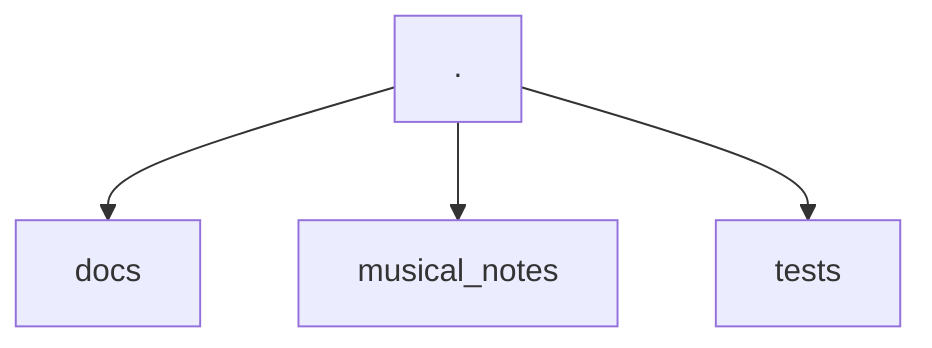
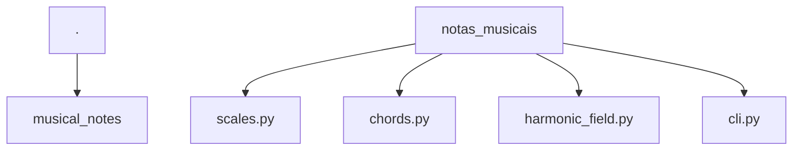
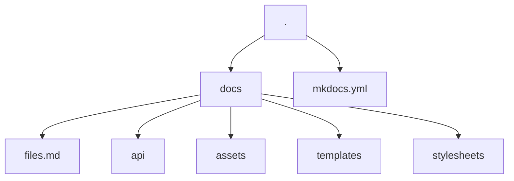

# How to contribute

Thank you for your interest in contributing to the `musical-notes` project.
In this document, we list the most common operations you may need to contribute.

How does the project work?

### Project Structure


The project is divided into three directories: `docs`, `notas_musicais`, and `tests`.
Each directory has its specific function.

#### musical_notes



The CLI code and library are in `musical_notes`.
The API documentation is also being done in `musical_notes` with
the [mkdocstrings](https://mkdocstrings.github.io/) tool, following the
 [docstrings do google](https://sphinxcontrib-napoleon.readthedocs.io/en/latest/example_google.html) standard.
 So if you change anything in the code, remember to update the docstrings as well.

The examples used in the docstrings are also used for testing. So if you change the output format, remember to update the docstrings.

#### About the library

The entire library uses pure Python, it has no dependency on external libraries.
This is intentional because the code is quite simple.
The function responses were standardized with the return always being a
Python dictionary because someone may want to expand it to a graphical i
nterface or use it in a REST API. Thus, I believe that a standard that can
be serialized can help people a lot.

Every time the code is consumed between functions, during the construction
 of the application, a pattern was created to unpack the dictionary into other
  functions. So don't worry if you see a lot of this code format:

```py
notes, degrees = func('arg1', 'arg2').values()
```

#### The CLI

The CLI was built using the [Typer](https://typer.tiangolo.com/) library and
you can check its documentation for more details if you want to expand the CLI functionalities.

For rich responses in the application output,
the [Rich](https://rich.readthedocs.io/en/stable/introduction.html) library was used.
If you want to change something related to the tables generated in the output,
you can go directly to the [pagina da documentação](https://rich.readthedocs.io/en/stable/tables.html) regarding tables.

The only convention being followed regarding the CLI is that a `Console`
object from rich and a `Typer` app have already been defined, so it would be
 interesting if you continued to use these objects:

```py title="musical_notes/cli.py"
from rich.console import Console
from typer import Argument, Typer
...
console = Console()
app = Typer()
```

#### Tests

For the tests, the library [pytest](https://docs.pytest.org/) was used.
Their configurations are found on [pyproject.toml](https://github.com/guidurbano/musical-notes/blob/main/pyproject.toml)
on the root of the directory.

Important things to note about tests are that not all tests are only in the
`musical_notes/tests` directory. The `addopts = "--doctest-modules"` flag is
being used. So if you modify something, be aware that docstrings also run
tests and are the basis for API documentation, so be careful with changes.

Coverage for the tests are generated automatically with [pytest-cov](https://github.com/pytest-dev/pytest-cov):

```bash
task tests
```

Just like the linters are required for the tests

#### Documentation

All documentation is based on [mkdocs](https://www.mkdocs.org/) with theme [mkdocs-material](https://squidfunk.github.io/mkdocs-material/).



All configurarion can be found on [mkdocs.yml](https://github.com/guidurbano/musical-notes/blob/main/mkdocs.yml) na raiz do repositório.

Also, templates based on [jinja](https://jinja.palletsprojects.com/en/3.1.x/) are used
and their apperance is seeing in blocks like:

```html
{ %  % }
```

The templates are defined in the /docs/templates directory.
In some cases, however, they may be called by variables with `command.run`
that appears in almost all documentation files. These macros are being made
with [mkdocs-macros](https://mkdocs-macros-plugin.readthedocs.io/en/latest/)
and are defined in the mkdocs configuration file:

```yaml
extra:
  commands:
    run: poetry run musical-notes
```

##### API documentation

The API documentation is being done within the code modules.
That's why the files in the `docs/api` directory have a tag:

```md
::: modulo
```

This means that the code contained in the docstrings in this block will be used.
The [mkdocstrings](https://mkdocstrings.github.io/) is being used for that.

The documentation in the modules follows the [docstrings do google](https://sphinxcontrib-napoleon.readthedocs.io/en/latest/example_google.html), which is the standard for the library.


## Tools

This project basically uses two tools as the basis for all control:

- [Poetry](https://python-poetry.org/):  for environment management and library installation
- [Taskipy](https://github.com/illBeRoy/taskipy): for automation of routine tasks, such as running tests, linters, documentation, etc...

So make sure you have poetry installed for this contribution:

```bash
pipx install poetry
```


## Steps to execute specific tasks

Here are listed commands that you can use to run routine tasks, such as cloning the repository, installing dependencies, running tests, and so on...

### How to clone the repository

```bash
git clone https://github.com/guidurbano/musical-notes.git
```

### How to install dependencies

```bash
poetry install
```

### How to execute the CLI

```bash
poetry run {{ commands.run }} [subcommand]
```

### How to execute code verification

```bash
task lint
```

### How to execute tests

```bash
task test
```

### How to execute documentation

```bash
task docs
```

### Tasks you can contribute




## Didn't find what you need here

If you didn't find what you need, you can open an [issue no projeto](https://github.com/dunossauro/notas-musicais/issues) reporting what you can't do or what needs to be better documented.

## Continuous improvement

This document can be improved by anyone interested in improving it.
 So feel free to provide more tips to people who want to contribute as well.
